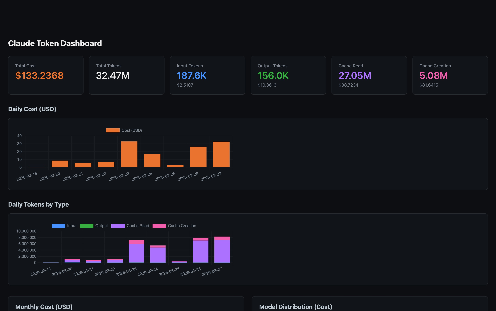
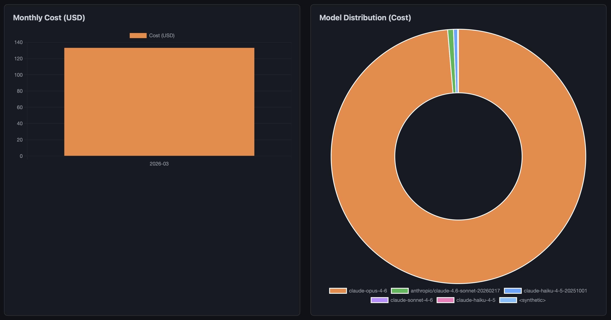
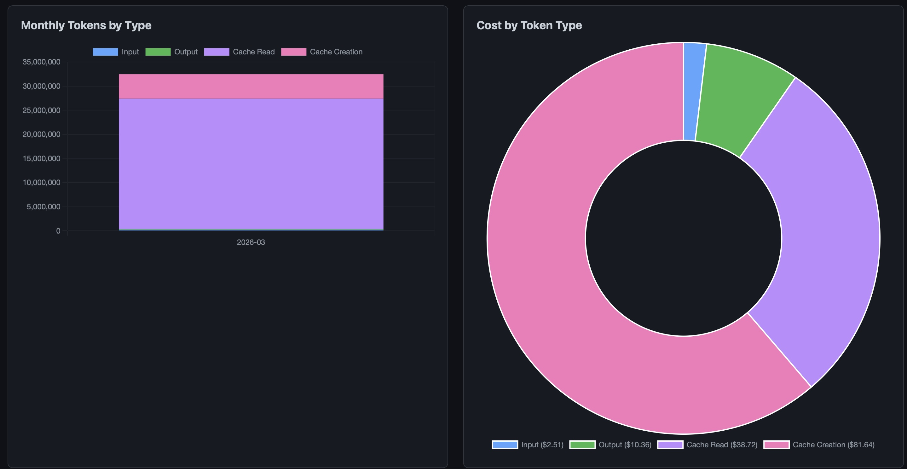
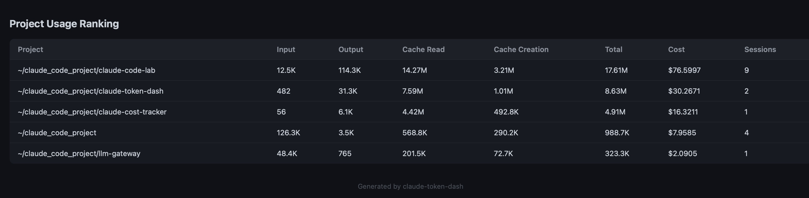

# Claude Cost Tracker

> **精确掌握你的 Claude Code Token 去向。**

[English](README.md) | [中文](README_CN.md)

Claude Code 的 `/cost` 只显示当前会话的消耗——关掉窗口数据就没了。**Claude Cost Tracker** 自动记录所有会话和项目的 token 用量，生成可视化看板，让你全局掌控。



## 为什么需要它？

- 你用着 Claude Max / API，想知道 **真实的使用情况**
- 你在 **多个项目** 间切换，想知道哪个项目最费钱
- 你想了解不同 **模型的成本差异**（Opus vs Sonnet vs Haiku）
- 你想看 **每日和每月的趋势**，追踪支出变化
- 你想知道 **缓存** 帮你省了多少

## 特性

- **全自动** — 安装后以 Stop hook 静默运行，每轮对话自动记录
- **零 token 消耗** — 使用 `command` 类型 hook，不调用 Claude API
- **全局看板** — 汇总所有窗口、会话、项目的数据
- **按 token 类型拆分费用** — 精确看到 Input、Output、Cache Read、Cache Creation 各花了多少
- **日/月趋势** — 发现消费模式，追踪支出变化
- **模型分布** — 对比 Opus、Sonnet、Haiku 的费用占比
- **项目排行** — 哪个项目消耗最多，一目了然
- **历史导入** — 首次安装自动导入已有的 transcript 数据
- **跨平台** — macOS、Windows、Linux
- **零依赖** — 纯 Python 3 + SQLite，无需 pip install

## 快速开始

```bash
git clone https://github.com/clockwise0215/claude-cost-tracker.git
cd claude-cost-tracker
python install.py        # macOS/Linux 也可用 python3
```

完成。Token 追踪立即生效，历史数据自动导入。

## 使用方式

### 打开看板

在 Claude Code 中输入：

```
/token-dash
```

浏览器会打开一个看板，包含：

| 模块 | 内容 |
|------|------|
| **总览卡片** | 总 token 数、总费用、各类型 token 费用（Input / Output / Cache Read / Cache Creation） |
| **每日费用** | 按天显示的费用柱状图 |
| **每日 Token** | 按天按类型堆叠的柱状图 |
| **每月费用** | 按月显示的费用柱状图 |
| **模型分布** | 环形图 — Opus vs Sonnet vs Haiku |
| **费用类型分布** | 环形图 — 钱花在哪种 token 上 |
| **项目排行** | 按费用排序的表格，含会话数 |

<details>
<summary>📊 更多看板截图（点击展开）</summary>

#### 月度费用 & 模型分布


#### 月度 Token & 费用类型分布


#### 项目消耗排行


</details>

### 直接查询数据库

```bash
sqlite3 ~/.claude/token_usage.db \
  "SELECT model, SUM(cost_usd) FROM token_usage GROUP BY model"
```

> **Windows 用户**：将 `~/.claude/` 替换为 `%USERPROFILE%\.claude\`

## 工作原理

```
Claude Code 一轮对话结束
        ↓
   Stop hook 触发
        ↓
track_tokens.py 读取 transcript JSONL（通过 stdin 获取路径）
        ↓
提取每条 assistant 消息的 token usage
        ↓
写入 ~/.claude/token_usage.db（SQLite，WAL 模式）
        ↓
/token-dash → dashboard.py → 生成 HTML → 浏览器打开
```

- 每条 assistant 消息有唯一的 `(session_id, message_id)` — 不会重复记录
- SQLite WAL 模式支持多个 Claude Code 窗口并发写入
- hook 遇到任何错误都静默退出 — 绝不阻塞你的工作流

## 更新定价

编辑 `~/.claude/hooks/pricing.json`：

```json
{
  "claude-opus-4-6": { "input": 15.0, "output": 75.0, "cache_read": 1.5, "cache_creation": 18.75 },
  "claude-sonnet-4-6": { "input": 3.0, "output": 15.0, "cache_read": 0.3, "cache_creation": 3.75 },
  "claude-haiku-4-5-20251001": { "input": 0.8, "output": 4.0, "cache_read": 0.08, "cache_creation": 1.0 }
}
```

单位：美元 / 百万 token。未知模型按 Sonnet 费率计算。

重新计算历史费用：
```bash
rm ~/.claude/token_usage.db && python3 ~/.claude/hooks/import_history.py
```

## 环境要求

- Python 3.7+
- 支持 hooks 功能的 Claude Code

无需 `pip install`，全部使用 Python 标准库。

## 卸载

```bash
python install.py --uninstall
```

移除脚本、命令和 hook 配置。数据库文件保留，如需删除请手动操作。

## 贡献

欢迎提 Issue 和 Pull Request！

## 许可证

MIT
